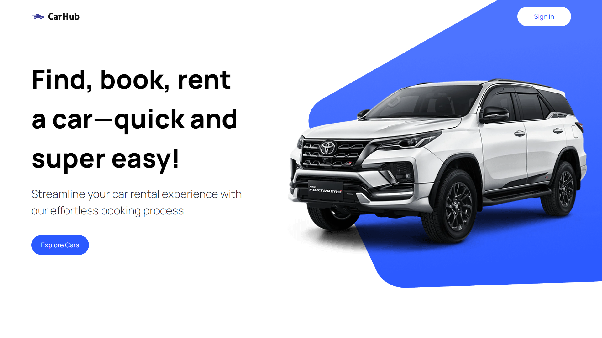

<div align="center">
    <a href="https://car-hub-fv.vercel.app" target="_blank">
      
    </a>
  <h3 align="center">Car Showcase Website</h3>
</div>

##  <br /> 📋 <a name="table">Table of Contents</a>

- ✨ [Introduction](#introduction)
- ⚙️ [Tech Stack](#tech-stack)
- 📝 [Features](#features)
- 🚀 [Quick Start](#quick-start)

##  <br /> <a name="introduction">✨ Introduction</a>

**[EN]** Developed with Next.js and leveraging its server-side rendering capabilities, this Car Showcase website presents various car types, showcasing comprehensive information in a well-designed format with advanced filtering and pagination support for an enhanced user experience.

**[FR]** Développé avec Next.js et exploitant ses capacités de rendu côté serveur, ce site web de présentation de voitures propose différents types de véhicules, offrant des informations détaillées dans un format bien conçu avec un support avancé de filtrage et de pagination pour une expérience utilisateur améliorée.

##  <br /> <a name="tech-stack">⚙️ Tech Stack</a>

- **React** is a JavaScript library for building user interfaces with a component-based architecture, facilitating reusable and maintainable code.

- **Next.js** is a powerful React framework that enables server-side rendering, automatic code splitting, and efficient performance optimizations for building modern web applications.

- **TypeScript** is a statically typed superset of JavaScript that enhances code quality and developer productivity by identifying errors early and enabling better tooling support.

- **Rapid API** is a platform that simplifies API integration by providing a marketplace of third-party APIs, allowing developers to discover, connect to, and manage APIs efficiently within their applications.

- **Tailwind** is an utility-first CSS framework that allows for rapid UI development by providing a set of utility classes for styling directly in HTML, promoting a scalable and consistent design system.

## <br/> <a name="features">📝 Features</a>

👉 **Home Page**: Showcases a visually appealing display of cars fetched from a third-party API, providing a captivating introduction to the diverse range of vehicles available.

👉 **Exploration and Filtering**: Explore a wide variety of cars from around the world, utilizing a search and filter system based on criteria such as model, manufacturer, year, fuel type, and make.

👉 **Transition to Server-Side Rendering**: A seamless transition from client-side rendering to server-side rendering, enhancing performance and providing a smoother browsing experience.

👉 **Pagination**: For easy navigation through a large dataset of cars, allowing users to explore multiple pages effortlessly.

👉 **Metadata Optimization and SEO**: Optimize metadata for car listing, enhancing search engine optimization (SEO) and ensuring better visibility on search engine results pages.

👉 **TypeScript Types**: Utilize TypeScript to provide robust typing for enhanced code quality and better development.

👉 **Responsive Website Design**: The website is designed to be visually pleasing and responsive, ensuring an optimal user experience across various devices.

## <br /> <a name="quick-start">🚀 Quick Start</a>

Follow these steps to set up the project locally on your machine.

<br/>**Prerequisites**

Make sure you have the following installed on your machine:

- [Git](https://git-scm.com/)
- [Node.js](https://nodejs.org/en)
- [npm](https://www.npmjs.com/) (Node Package Manager)

<br/>**Cloning the Repository**

```bash
git clone {git remote URL}
```

<br/>**Installation**

Let's install the project dependencies, from your terminal, run:

```bash
npm install
# or
yarn install
```

<br/>**Set Up Environment Variables**

Create a new file named `.env` in the root of your project and add the following content:

```env
NEXT_PUBLIC_RAPID_API_KEY=
NEXT_PUBLIC_IMAGIN_API_KEY=
```

Replace the placeholder values with your actual credentials:

- [Rapid API](https://dashboard.clerk.com)
- [Cloudinary](https://dashboard.imagin.studio)

<br/>**Running the Project**

Installation will take a minute or two, but once that's done, you should be able to run the following command:

```bash
npm run dev
# or
yarn dev
```

Open [`http://localhost:3000`](http://localhost:3000) in your browser to view the project.